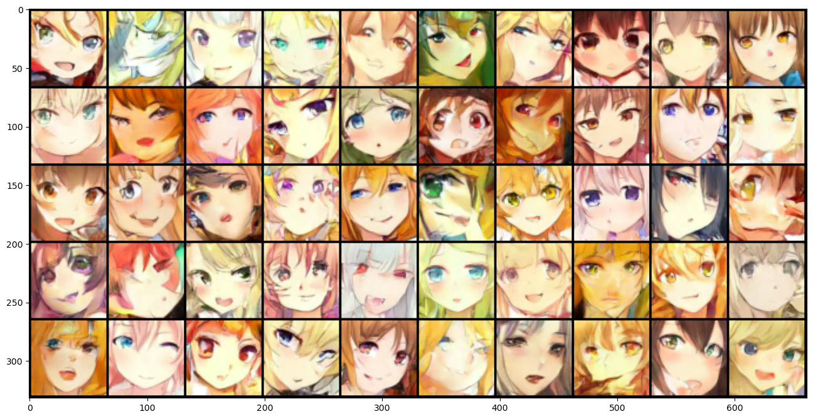

**What are stable diffusion models**  

Stable diffusion models are state-of-art deep generative models in the machine learning field. They are capable of generating photo-realistic images from latent space and have been gaining significant attention in the past several years. Many famous generative AI websites [DALL-E 2](https://openai.com/dall-e-2), [Midjourney](https://www.midjourney.com/home/?callbackUrl=%2Fapp%2F), etc are based on the technique of stable diffusion models 

**What is the goal of this notebook**  
  
In this notebook, I tried to build an ***unconditional*** denoising diffusion model from scratch and used the model to generate anime faces.    

**Anime faces generated from latent space:**
  

  
My codes and results are shown below. 
  

**References**:  
[Denoising Diffusion Probabilistic Models](https://arxiv.org/abs/2006.11239)  
[Improved Denoising Diffusion Probabilistic Models](https://arxiv.org/abs/2102.09672?ref=assemblyai.com)  
[How stable diffusion work](https://stable-diffusion-art.com/how-stable-diffusion-work/#:~:text=Stable%20Diffusion%20is%20a%20latent,why%20it's%20a%20lot%20faster)  

**Github**:  
[Sung-Soo Kim's implementation](https://colab.research.google.com/drive/1sjy9odlSSy0RBVgMTgP7s99NXsqglsUL?usp=sharing)  
[Niels Rogge & Kashif Rasul's implementation](https://colab.research.google.com/github/huggingface/notebooks/blob/main/examples/annotated_diffusion.ipynb#scrollTo=3a159023)
